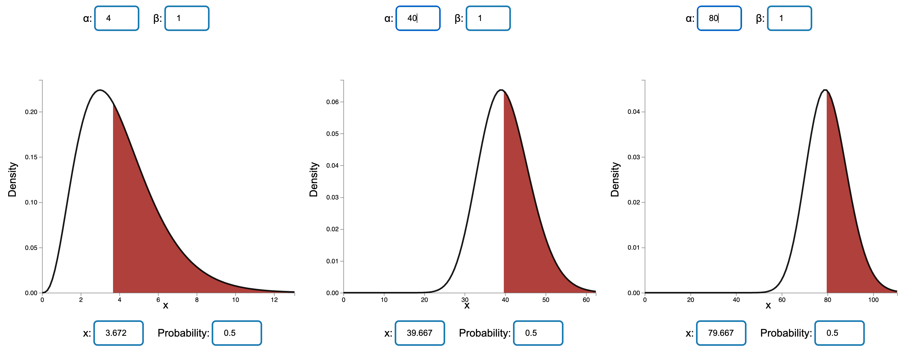
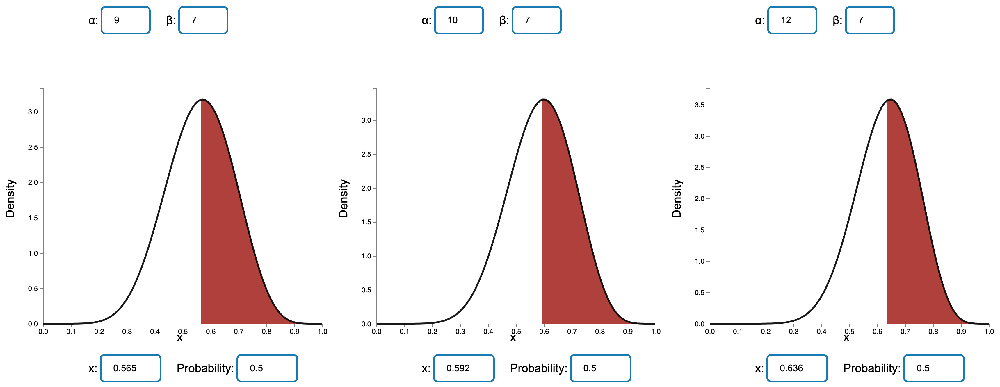
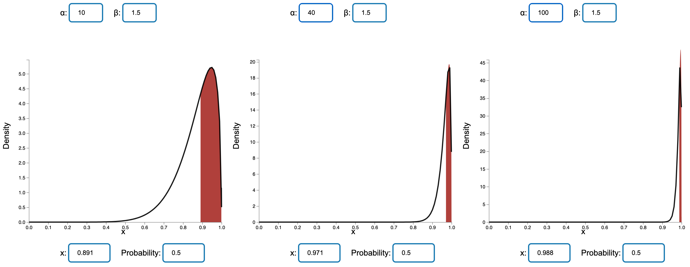
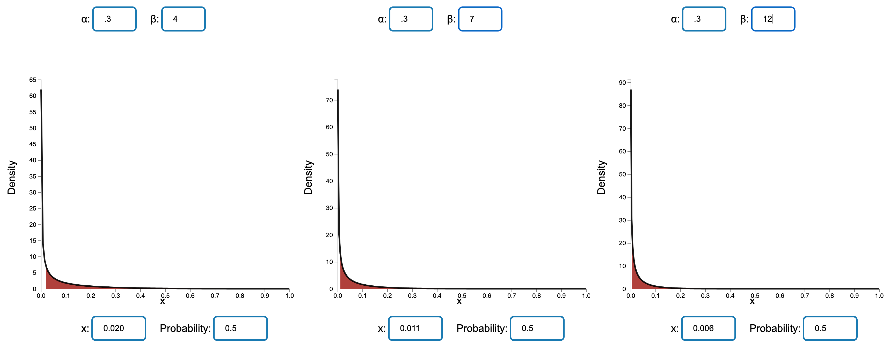
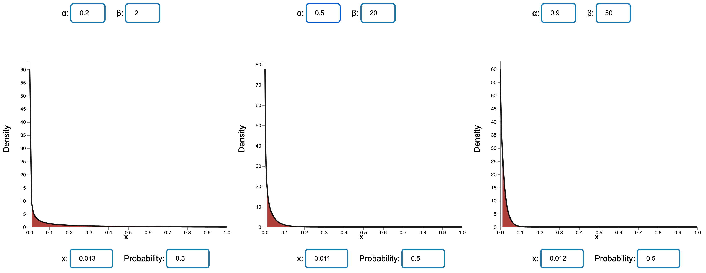

```{r setup, include=FALSE}
knitr::opts_chunk$set(echo = TRUE)
```

# Monte Carlo Methods
## Question 1: 
Derive a formula and explain how to generate a random variable with the density.
$$
f(x)=1.5\sqrt{x} for 0 < x < 1
$$
if your random number generator produces a Standard Uniform random variable U. Use the inverse transform method. Compute this variable if U = 0.001.

\textbf{\textcolor{blue}{Answer:}} 

According to the question, the density function is  $f(x)=1.5\sqrt{x}$ in $(0,1)$. To calculate the cumulative density function, we have:
$$
F(x) = \int_{0}^{x}{f(x)dx} = \int_{0}^{x}{1.5\sqrt{x}dx} = 1.5[\frac{2}{3}t^{\frac{3}{2}}]_{0}^{x}= [t^{\frac{3}{2}}]_{0}^{x} = x^{\frac{3}{2}}
$$
To computer the random variable,we apply the inverse transform method to $F(x)$, since $U=x^{\frac{3}{2}}$ and $U=0.001$, we have:
$$
x=U^{\frac{2}{3}}=0.001^{\frac{2}{3}}=0.01
$$
So the answer is $0.01$.

## Question 2: 
Twenty computers are connected in a network. One computer becomes infected with a virus. Every day, this virus spreads from any infected computer to any uninfected computer with probability 0.1. Also, every day, a computer technician takes 5 infected computers at random (or all infected computers, if their number is less than 5) and removes the virus from them. Estimate:

\textbf{(a)} the expected time it takes to remove the virus from the whole network;

\textbf{(b)} the probability that each computer gets infected at least once;

\textbf{(c)} the expected number of computers that get infected.

\textbf{\textcolor{blue}{Answer:}} 

From the question, we know that a health computer get infected at the probability of $p=0.1$. Sample size $n = 20$. A computer technician can fix at most infected 5 computers at one time. 

The code for this question attached as a appendix.

\textbf{(a)} 

The R code as follows, the answer is 20.882 days , so we need 21 day.


```{R q2a }
# Init simulations time
num_simulations <- 5000

# Init vector to save result
results <- numeric(num_simulations)

for (i in 1:num_simulations) {
  # Initialize a vector to represent the infected status of each computer
  infected <- rep(FALSE, 20)
  
  # Start with one infected computer
  infected[1] <- TRUE
  infected_count <- 1
  
  day = 1
  while (infected_count < 20) {
    # virus spreading model
    new_infections <- sample(1:20, sum(!infected), prob = rep(0.1, 20))
    infected[new_infections] <- TRUE
    infected_count <- sum(infected)
    day <- day + 1
  }
  
  # save the result 
  results[i] <- day
}

exp_day <- mean(results)

cat("expected time it takes to remove the virus from the whole network: ",exp_day)
```

\textbf{(b) } 
According to the code execution result, if we set max_step=100,num_simulations=5000,  all computers will be infected's probability is  0.9942.

```{R q2b }
# Init simulations time
num_simulations <- 5000
max_step <- 100

# Init vector to save result
results <- numeric(num_simulations)

for (i in 1:num_simulations) {
  # Initialize a vector to represent the infected status of each computer
  infected <- rep(FALSE, 20)
  
  # Start with one infected computer
  infected[1] <- TRUE
  infected_count <- 1
  
  step <- 1
  while (infected_count < 20) {
    # virus spreading model
    new_infections <- sample(1:20, sum(!infected), prob = rep(0.1, 20))
    infected[new_infections] <- TRUE
    infected_count <- sum(infected)
    if (step < max_step){
      step <- step + 1
    }else{
      break
    }
  }
  
  # save the result 
  results[i] <- all(infected)
}

# calc the probability that each computer gets infected at least once
probability <- mean(results)

cat("Each computer gets infected at least once's probability: ",probability)
```

\textbf{(c)}

According to the code execution result,  if we set max_step=100,num_simulations=5000,the expected number of computers that get infected is 19.9942
```{R q2c }
# Number of simulations
num_simulations <- 5000
max_step <- 100

# Initialize a vector to store the results for each simulation
results <- numeric(num_simulations)

for (i in 1:num_simulations) {
  # Initialize a vector to represent the infected status of each computer
  infected <- rep(FALSE, 20)
  
  # Start with one infected computer
  infected[1] <- TRUE
  infected_count <- 1
  step <- 1
  while (infected_count < 20) {
    # virus spreading model
    new_infections <- sample(1:20, sum(!infected), prob = rep(0.1, 20))
    infected[new_infections] <- TRUE
    infected_count <- sum(infected)
     if (step < max_step){
      step <- step + 1
    }else{
      break
    }
  }
  
  # save the result 
  results[i] <- infected_count
}

# calc the expected infected computers
exp_infected <- mean(results)

cat("Expected infected computers :", exp_infected)
```

# Computer Exercises from Course book

## Exercise 4.84
Use the applet Comparison of Gamma Density Functions to compare gamma density functions with ($\alpha=4,\beta=1$), ($\alpha=40,\beta=1$), and ($\alpha=80,\beta=1$).

\textbf{(a)} What do you observe about the shapes of these three density functions? Which are less skewed and more symmetric?

\textbf{(b)} What differences do you observe about the location of the centers of these density functions?

\textbf{(c)} Give an explanation for what you observed in part (b).

\textbf{\textcolor{blue}{Answer:}} 

we use the \href{https://college.cengage.com/nextbook/statistics/wackerly_966371/student/html/04_gamma_probs.html}{(link)} to plot the image.



\textbf{(a)} 

We found that the three graphs are bell-shaped and not symmetrical based on a center value x.

When $\beta$ is fixed and $\alpha$ is relatively small, the graph is more likely to be skewed. however, when $\alpha$ get larger, it's more likely to be more symmetric. But with a longer tail on the lefe.

\textbf{(b)} 

If we set probability to 0.5, we can found that the center of those plots are little bit less than $\alpha$, around $0.4$.

We also found when alpha is greater than 1, the distribution is left-skewed, with a longer tail on the left.

The center or peak of the gamma distribution is also determined by the value of alpha. when alpha grow, center or peak of the gamma distribution move to right.

We also find when $alpha$ grow, the distribution get narrower.

\textbf{(c)}

Because $\alpha$ is the shape parameter of Gamma Density Function. So change this will change the shape.

And the mean of gamma distribution is $\alpha \beta$, so if $beta$ fixed, when $alpha$ increase, mean will increase, which make the center move to the right. 

## Exercise 4.117

Use the applet Comparison of Beta Density Functions to compare beta density functions with ($\alpha=9,\beta=7$), ($\alpha=10,\beta=7$), and  ($\alpha=12,\beta=7$).

\textbf{(a)} Are these densities symmetric? Skewed left? Skewed right?

\textbf{(b)} What do you observe as the value of $\alpha$ gets closer to 12?

\textbf{(c)}Graph some more beta densities with $\alpha > 1, \beta > 1$, and $\alpha > \beta$. What do you conjecture about the shape of beta densities with  $\alpha > \beta$ and both $\alpha > 1$ and $\beta > 1$?

\textbf{\textcolor{blue}{Answer:}} 

we use the \href{https://college.cengage.com/nextbook/statistics/wackerly_966371/student/html/04_beta_probs.html}{link} to plot the image.



\textbf{(a)} 

Compare to the Gamma distribution density functions, the plots of Beta distribution density function are more likely to be symmetric. But we also found that there have a long tail on the left, so all of the three plots are left skewed.

\textbf{(b)} 

When $\alpha$  gets closer to 12, we find that the middle point of the plot moves to the right, and a change of 3 in $\alpha$ makes an increase of 0.071 in x. and the graph are more likely to be symmetric.

\textbf{(c)}  

When $\alpha > \beta$ ,we set $\beta = 1.5$, $\alpha=10,40,100$ . We found the distribution area get smaller, and center of it get closer to 1. 

\newpage 



## Exercise 4.118

Use the applet Comparison of Beta Density Functions to compare beta density functions with ($\alpha=.3,\beta=4$), ($\alpha=.3,\beta=7$), and ($\alpha=.3,\beta=12$).

\textbf{(a)}  Are these densities symmetric? Skewed left? Skewed right?

\textbf{(b)}  What do you observe as the value of $\beta$ gets closer to 12?

\textbf{(c)}  Which of these beta distributions gives the highest probability of observing a value larger than 0.2?

\textbf{(d)}  Graph some more beta densities with $\alpha < 1$ and $\beta > 1$. What do you conjecture about the shape of beta densities with$\alpha < 1$ and $\beta > 1$?
        
\textbf{\textcolor{blue}{Answer:}} 

we use the \href{https://college.cengage.com/nextbook/statistics/wackerly_966371/student/html/04_beta_probs.html}{link} to plot the image.



\textbf{(a)} 

All the densities function plots are not symmetric and all of them are skewed to the right.

\textbf{(b)} 

We found that when $\alpha < 1$ and fixed,  $\beta > 1$ and get larger,  the point x corresponding to the 0.5 probability will get closer to 0.

\textbf{(c)} 

According to the plots, we can find that the distribution with $\alpha = .3$ and $\beta = 4$ has the highest probability.

\textbf{(d)} 

When we set  $\alpha < 0$ and $\beta >1$ , all the sharps are almost same according to the plot below.



## Exercise 10.19

The output voltage for an electric circuit is specified to be 130. A sample of 40 independent readings on the voltage for this circuit gave a sample mean 128.6 and standard deviation 2.1. Test the hypothesis that the average output voltage is 130 against the alternative that it is less than 130. Use a test with level .05.

\textbf{\textcolor{blue}{Answer:}} 

We are interested in the voltage for an electric circuit is equal to 130 or less than 130. This can be written as $H_{a} : \mu < 130$, where $\mu$ is the mean value of the voltage for an electric circuit. Thus, we are interested in testing.

$$
H_{0}:\mu = 130 
$$
$$
H_{a}:\mu < 130
$$

For large n, the sample mean $Y$ is a point estimator of $\mu$ that is approximately normally distributed with $u_{\bar{Y}} = \mu$ and $\sigma_{\bar{Y}} = \frac{\sigma}{\sqrt{n}}$. 

Hence, our test statistic is

$$
Z = \frac{\bar{Y} - \mu_{0}}{\sigma_{\bar{Y}} } = \frac{\bar{Y} - \mu_{0}}{\sigma/\sqrt{n}} 
$$
Since test level $\alpha = 0.05$ is given by ${z < z_{-0.05} = -1.645}$. $\Sigma = 2.1$ , $n = 40$ and $\bar{Y}=128.6$. 

Thus the observed value of the test statistic is:

$$
z = \frac{\bar{Y} - \mu_{0}}{\sigma/\sqrt{n}} = \frac{128.6-130}{2.1/\sqrt{40}} = -4.217
$$
Because -4.217 lines in the reject zone, we reject $H_{0}$.

Thus, at the test level $\alpha = 0.05$, $H_{0}:\mu = 130$ is not sufficient, so we accept $H_{a}$, which is the voltage for an electric circuit is less than 130.

## Exercise 10.21 
 
Shear strength measurements derived from unconfined compression tests for two types of soils gave the results shown in the following table (measurements in tons per square foot). Do the soils appear to differ with respect to average shear strength, at the 1\% significance level?

| Soil Type I         | Soil Type II         |
|---------------------|----------------------|
| $n_{1} = 30$        | $n_{2} = 35$         |
| $\bar{y}_{1} = 1.65$| $\bar{y}_{2} = 1.43$ |
| $s_{1} = 0.26$      | $s_{2} = 0.22$       |

\textbf{\textcolor{blue}{Answer:}} 

We are interested in differ with respect to average shear strength. 

Let $\mu_{1}$ and $\mu_{2}$ denote true mean shear strength of the soils.We shall have $H_{0}:(\mu_{1} - \mu_{2} = 0)$ vs $H_{a}:(\mu_{1} - \mu_{2} \neq 0)$

Point estimator of ($\mu_{1} - \mu_{2}$) is ($Y_{1} - Y_{2}$) ,  since $n1,n2 \geq 30$ , it satisfies the necessary to develop a large-sample test.

Hence if we desire to test $H_{0}:(\mu_{1} - \mu_{2} = D_{0})$ ($D_{0}$ is a fixed value) vs any alternative, we have

$$
Z = \frac{(\bar{Y}_{1} - \bar{Y}_{2})-D_{0}} {\sqrt{\frac{\sigma_{1}^2}{n_{1}} + \frac{\sigma_{2}^2}{n_{2}}}}
$$
Since $\alpha=0.05$, we have $|z| > z_{\alpha/2}=z_{0.005} = 2.575$, and

$$
Z = \frac{(\bar{Y}_{1} - \bar{Y}_{2})-0} {\sqrt{\frac{\sigma_{1}^2}{n_{1}} + \frac{\sigma_{2}^2}{n_{2}}}} \approx \frac{1.65 - 1.43} {\sqrt{\frac{0.26^2}{30} + \frac{0.22^2}{35}}} = 3.67
$$
Because 3.67 lines in the reject zone, we reject $H_{0}$, which means we reject that soils appear to same with respect to average shear strength.

## Exercise 11.31

Using a chemical procedure called differential pulse polarography, a chemist measured the peak current generated (in microamperes, $\mu$A) when solutions containing different amounts of nickel (measured in parts per billion, ppb) are added to different portions of the same buffer. Is there sufficient evidence to indicate that peak current increases as nickel concentrations increase? Use $\alpha=.05$.

 |x = Ni (ppb)  |y = Peak Current ($\mu A$)  |
 |--------------|----------------------------|
 |19.1   |0.095  |
 |38.2   |0.174  |
 |57.3   |0.256  |
 |76.2   |0.348  |
 |95     |0.429  |
 |114    |0.500  |
 |131    |0.580  |
 |150    |0.651  |
 |170    |0.722  |
 
\textbf{\textcolor{blue}{Answer:}} 

According to the question, let's set the formula
$$
y = \beta_{0} + \beta_{1} x
$$

And we calculate the following table.

|$x_{i}$  |$y_{i}$  | $x_{i}y_{i}$ |  $x_{i}^2$ |
|-------|-------|------------|----------|
|	19.1	|	0.095	|	1.8145	|	364.8	|
|	38.2	|	0.174	|	6.6468	|	1459.2	|
|	57.3	|	0.256	|	14.6688	|	3283.3	|
|	76.2	|	0.348	|	26.5176	|	5806.4	|
|	95.0	|	0.429	|	40.755	|	9025.0	|
|	114.0	|	0.500	|	57	|	12996.0	|
|	131.0	|	0.580	|	75.98	|	17161.0	|
|	150.0	|	0.651	|	97.65	|	22500.0	|
|	170.0	|	0.722	|	122.74	|	28900.0	|
|$\sum_{i=1}^{n}x_{i} = 850$ | $\sum_{i=1}^{n}y_{i} = 3.755$| $\sum_{i=1}^{n}x_{i}y_{i} = 443.7727$ | $\sum_{i=1}^{n}x_{i}x_{i} = 101495.8$ |

we obtain

$$
\hat{\beta_{1}} = \frac{S_{xy}}{S_{xx}} = \frac
{\sum_{i=1}^{n}x_{i}y_{i} - \frac{1}{n} \sum_{i=1}^{n}x_{i}\sum_{i=1}^{n}y_{i}}
{\sum_{i=1}^{n}x_{i}^2 -\frac{1}{n} (\sum_{i=1}^{n}x_{i})^2 } = 
\frac{443.7727-\frac{1}{9} * 850.8 * 3.755}{101495.8 - \frac{1}{9}*850.8^2} = 0.0042
$$

$$
\bar{y} = \frac{3.755}{9} = 0.4172
$$
$$
\bar{x} = \frac{850}{9} = 94.53333
$$

$$
\hat{\beta_{0}} = \bar{y}-\hat{\beta_{1}\bar{x}} = 0.4172 - 0.0042 * 94.5333 = 0.02016
$$
So the fitted line is 

$$
y = 0.02016 + 0.0042 x
$$

Then to test peak current increases as nickel concentrations increase, means $\beta_{1} > 0$.

So we set $H_{0}:\beta_{1} = 0$ vs $H_{a}:\beta_{1} > 0$

Since $\hat{\beta_{1}} = 0.0042$ , $S_{xx} =21066.84$, $S_{xy} =21066.84$, $n=9$ , $c_{11} = \frac{1}{S_{xx}} = 4.747e-5$ 

Then 
$$
t  = \frac{\hat{\beta_{1}} - 0}{s\sqrt{c_{11}}} = 2.37e-11
$$

If we take $\alpha=0.05$, the value of $t_{\alpha} = t_{0.05}$ for 7 df is 1.895.

So we know that $H_{0}$ is rejected and we can conclude that peak current increases as nickel concentrations increase.

## Exercise 11.69
The manufacturer of Lexus automobiles has steadily increased sales since the 1989 launch of that brand in the United States. However, the rate of increase changed in 1996 when Lexus introduced a line of trucks. The sales of Lexus vehicles from 1996 to 2003 are shown in the accompanying table.
 
 |x      |y      |
 |-------|-------|
 |1996   |18.5   |
 |1997   |22.6   |
 |1998   |27.2   |
 |1999   |31.2   |
 |2000   |33.0   |
 |2001   |44.9   |
 |2002   |49.4   |
 |2003   |35.0   |
 
\textbf{(a)} Letting Y denote sales and x denote the coded year(?7 for 1996, ?5 for 1997, through 7 for 2003), fit the model $Y =\beta_{0} +\beta_{1}x+\epsilon$

\textbf{(b)} For the same data, fit the model $Y =\beta_{0} +\beta_{1}x+\beta_{2}x^2 + \epsilon$
 
\textbf{\textcolor{blue}{Answer:}} 

\textbf{(a)} 

According to the question, let's set the formula
$$
y = \beta_{0} + \beta_{1} x + \epsilon
$$

And we set x to -7,-5,-3,-1,1,3,5,7 respectively.

We use matrix method to calculate $\beta_{0}$ and $\beta_{1}$.

$$Y = \begin{bmatrix}
18.5 \\ 22.6 \\ 27.2 \\ 31.2 \\ 33.0 \\ 44.9 \\ 49.4 \\ 35.0 
\end{bmatrix}$$


$$X = \begin{bmatrix}
1 & -7 \\ 1 & -5\\ 1 & -3\\ 1 & -1\\ 1 & 1\\ 1 & 3\\ 1 & 5\\ 1 & 7 
\end{bmatrix}$$

We have

$$X'X = \begin{bmatrix}
8 & 0 \\
0 & 168
\end{bmatrix}$$

$$X'Y  = \begin{bmatrix}
261.8 \\
304.4
\end{bmatrix}$$

$$(X'X)^{-1}  = \begin{bmatrix}
0.125 & 0 \\
0 & 0.005952381
\end{bmatrix}$$

Then we get 
$$
\beta =(X'X)^{-1}X'Y = 
\begin{bmatrix}
32.725 \\
1.8119
\end{bmatrix}$$
So the fitted line is 

$$
y = 32.725 + 1.8119x
$$
\textbf{(b)} 


According to the question, let's set the formula
$$
y = \beta_{0} + \beta_{1} x + \beta_{2} x^2 + \epsilon
$$

And we set x to -7,-5,-3,-1,1,3,5,7 respectively.

We use matrix method to calculate $\beta_{0}$ and $\beta_{1}$.

$$Y = \begin{bmatrix}
18.5 \\ 22.6 \\ 27.2 \\ 31.2 \\ 33.0 \\ 44.9 \\ 49.4 \\ 35.0 
\end{bmatrix}$$


$$X = \begin{bmatrix}
1 & -7 & 49\\ 1 & -5 & 25\\ 1 & -3 & 9\\ 1 & -1 & 1\\ 1 & 1 & 1\\ 1 & 3 & 9\\ 1 & 5 & 25\\ 1 & 7 & 49 
\end{bmatrix}$$

We have

$$X'X = \begin{bmatrix}
8 & 0 & 168 \\
0 & 168 & 0\\
168 & 0 & 6216
\end{bmatrix}$$

$$X'Y  = \begin{bmatrix}
261.8 \\
304.4 \\
5134.6
\end{bmatrix}$$

$$(X'X)^{-1}  = \begin{bmatrix}
0.2890625 & 0  &  -0.0078125000 \\
0 & 0.005952381  &  0 \\
-0.0078125 & 0 & 0.0003720238
\end{bmatrix}$$

Then we get 
$$
\beta =(X'X)^{-1}X'Y = 
\begin{bmatrix}
35.562500 \\
1.811905 \\
-0.135119
\end{bmatrix}$$
So the fitted line is 

$$
y = 35.562500 + 1.811905 x - 0.135119 x^2 
$$


